# 🖥️ LiveWall — Real-Time Event Interaction Wall

LiveWall is a high-performance, real-time interactive projection system designed for conferences and live events. The platform allows attendees to scan a localized QR code, access a friction-free mobile web application (no app download required), and submit a message along with an optional photo. Submissions are instantly projected onto a giant screen at the venue with elegant transitions, while event coordinators can hide or permanently delete posts in real time from a password-gated moderation dashboard.

Built with a modern, high-fidelity stack: **React 19**, **Vite**, **TailwindCSS v4**, and **Firebase** (Realtime Database + Cloud Storage + Anonymous Authentication).

---

## 🚀 Key Technical Pillars

* **Zero-Latency Synchronization:** Leverages Firebase Realtime Database's WebSocket-based data synchronization, delivering sub-second updates from user upload to projector display.
* **Strict Content Moderation:** Unified, password-gated moderation dashboard offering staff one-tap visibility toggles ("Hide") and permanent records purging ("Delete").
* **Client-Side Edge Compression:** Compresses heavy raw smartphone photos (4–12 MB) down to lean, optimized payloads (<600 KB) using client-side Web Workers before transmission, conserving venue bandwidth and preventing projector memory lag.
* **Dynamic Ambient Presentation:** A responsive, fluid masonry layout engineered for dark ambient projection environments, featuring smooth entrance animations, drifting backdrop glows, and automated fallback/lull protection.

---

## 🗺️ App Surfaces & Routes

| Route | Surface Name | Purpose & Tech Highlights |
| :--- | :--- | :--- |
| `/` | **Operator Launcher** | Standard operator portal for entering any `eventId` and quickly booting up the corresponding form, dashboard, or live wall. |
| `/join/:eventId` | **Attendee Upload Form** | The QR deep-link landing page. Silently establishes anonymous Firebase Auth, validates file size/type, runs local Web Worker compression, and handles offline states gracefully. |
| `/event/:eventId/admin` | **Moderation Dashboard** | A password-protected panel showing all event submissions. Offers one-tap hide/unhide and deletion actions, real-time submission counts, and offline resilience. |
| `/event/:eventId/wall` | **Live Projection Wall** | Projected fullscreen view (Fullscreen API). Uses CSS-only masonry columns, bouncy entering transitions, a memory-capped DOM (max 16 cards), and a lull-detecting fallback QR code slider. |

---

## 🎹 Venue Operator Keyboard Shortcuts

When displaying the **Live Projection Wall** (`/event/:eventId/wall`) on the venue's big screen, operators can control presentation modes instantly from any attached keyboard using these zero-click shortcuts:

| Key | Command | Action Description |
| :---: | :--- | :--- |
| <kbd>F</kbd> | **Toggle Fullscreen** | Instantly enters or exits true full-screen browser projection mode (using the HTML5 Fullscreen API). |
| <kbd>Q</kbd> | **Toggle Fallback QR** | Instantly toggles/forces the giant scannable QR code fallback overlay. Perfect when a presenter wants the audience to focus on scanning. |

---

## ⚙️ Standout Engineering Patterns

### 1. Edge Compression Pipeline
Smartphone cameras produce huge images (up to 12 MB). To avoid choking the venue's network or crushing the browser's memory, `src/lib/compressImage.js` uses `browser-image-compression` executed inside a **Web Worker**:
* Limits images to a resolution of `1200px` (width/height) and size of `0.6 MB` at `80%` JPEG quality.
* Keeps the main React UI thread completely fluid and responsive during processing.
* Features defensive fallback: if compression fails, it falls back to uploading the original file rather than breaking the user's flow.

### 2. Real-Time Memory-Capped Wall
To safeguard the projection browser from memory crashes during continuous multi-hour venue operations:
* **Database Constraint:** The Firebase database query is constrained using `limitToLast(30)`, ensuring only a narrow window of recent posts is held in memory.
* **DOM Capping:** `useWallController` slices this list to show a maximum of `16` visible cards. React automatically handles mounting new cards (triggering bouncy `@keyframes pop-in` CSS animations) and unmounting old ones.

### 3. Heartbeat & Lull Protection
If audience interaction slows down, a stagnant screen can look broken. LiveWall implements an automatic **heartbeat manager**:
* A continuous background timer evaluates the feed every `10s`.
* If no new posts are approved for `60s`, the layout gracefully crossfades to a high-contrast, scannable QR slide (`FallbackQR`), inviting attendees to scan and participate.
* **Interrupt Handler:** The exact millisecond a new approved post is detected in the RTDB stream, the system immediately terminates the fallback slideshow and transitions seamlessly back to the live feed.

### 4. Runtime Event Re-Theming
LiveWall supports custom primary and secondary branding colors, character constraints, and custom rotation speeds on a per-event basis. 
* Database changes are listened to in real time (`listenSettings`).
* As a side-effect, `useEventSettings` binds these branding colors to CSS custom properties (`--event-primary`, `--event-secondary`) on `document.documentElement`.
* The entire Tailwind v4 theme instantly re-renders with the new colors without React state-management overhead.

### 5. Defensive Offline Resilience
Attendee mobile connections are notoriously unstable at crowded venues. LiveWall implements comprehensive connectivity checks:
* Monitors active browser connectivity status using the `useOnlineStatus` hook.
* Displays a localized warning banner the moment the user drops offline, preventing frustrating form-submission failures.

### 6. Fully Localized UI Architecture
The interface is built with an elegant, centralized localization engine in `src/i18n/strings.js`:
* Single source of truth supplying gorgeous, curated Italian UI copy.
* Functional formatters for correct localization pluralization rules (e.g. character counters).
* Designed for frictionless addition of sibling languages (e.g., English, Spanish) by matching the exported shape.

---

## 📊 System Flow & Data Architecture

```mermaid
sequenceDiagram
    autonumber
    actor Attendee as Attendee (Mobile)
    actor Staff as Moderator (Admin Board)
    participant Storage as Firebase Cloud Storage
    participant RTDB as Firebase Realtime Database
    actor Screen as Projection Screen (Wall)

    Note over Attendee: Scans QR Code deep-link
    Attendee->>RTDB: Anonymous Firebase Auth (Silent)
    Attendee->>Attendee: Compress image client-side (Web Worker)
    Attendee->>Storage: Upload compressed image to /eventId/pending/
    Attendee->>RTDB: Post written to events/eventId/approved_posts
    RTDB-->>Screen: Real-time synchronization (Active listener)
    Note over Screen: Animates new card into view (DOM capped at 16)
    
    Note over Staff: Reviews active post feed
    Staff->>RTDB: Toggle "hidden: true" OR delete post
    rect rgb(10, 11, 18)
        note right of RTDB: Real-Time Cascade
        RTDB-->>Screen: Instantly unmounts/hides card
        RTDB->>Storage: Delete object from storage (on delete action)
    end
```



---

## 📂 Directory Structure

```
livewall/
├── firebase.json            # Firebase deployment hosting settings
├── vite.config.js           # Vite React config with Tailwind support
├── index.html               # Root HTML mount point
├── .env.example             # Baseline template for project setup
└── src/
    ├── App.jsx              # Client-side routing map (react-router-dom v7)
    ├── main.jsx             # Application bootstrapper
    ├── index.css            # Tailwind CSS imports & custom @keyframes animations
    ├── components/
    │   ├── AdminGate.jsx    # Passcode input gateway protecting moderator view
    │   ├── Button.jsx       # Sleek reusable action element
    │   ├── FallbackQR.jsx   # High-contrast projector-washout resistant QR slide
    │   ├── FallbackRotator.jsx # Slideshow rotator shown during traffic lulls
    │   ├── FirebaseNotice.jsx  # Visual guide shown if Firebase credentials are missing
    │   ├── Modal.jsx        # Luminous, premium alert backdrop overlay
    │   ├── Spinner.jsx      # Fluid, dynamic loading indicator
    │   └── WallCard.jsx     # Translucent, glowing individual post layout card
    ├── data/
    │   └── fallbackSlides.js # Pre-cached slides definitions (QR/Sponsors)
    ├── firebase/
    │   ├── config.js        # SDK initialization, config check, & Anonymous Auth
    │   ├── paths.js         # Centralized, shallow path dictionary for database/storage
    │   ├── posts.js         # CRUD interactions: submit, toggle visibility, delete
    │   └── storage.js       # Image upload & garbage-collection methods
    ├── hooks/
    │   ├── useEventSettings.js # Synchronizes database parameters to root CSS variables
    │   ├── useOnlineStatus.js  # Real-time browser network connectivity monitor
    │   ├── usePosts.js         # Real-time active queries for admin & approved lists
    │   └── useWallController.js # Master hook driving DOM constraints & lull timers
    ├── i18n/
    │   └── strings.js       # Centralized single-source-of-truth localization (Italian)
    └── lib/
        ├── compressImage.js # Client-side image compressor & verification rules
        └── eventUrl.js      # Generates deployed attendee URLs dynamically
```

---

## ⚙️ Local Installation & Run

### 1. Clone & Dependency Setup
Install all project requirements in your local working directory:
```bash
npm install
```

### 2. Configure Environment Variables
Create a local configuration file:
```bash
cp .env.example .env.local
```
Open `.env.local` and fill in your Firebase Project coordinates (found under *Firebase Console → Project Settings → General → Your Apps*).

```ini
# Firebase configuration values
VITE_FIREBASE_API_KEY=AIzaSyA1...
VITE_FIREBASE_AUTH_DOMAIN=your-project.firebaseapp.com
VITE_FIREBASE_DATABASE_URL=https://your-project-default-rtdb.firebaseio.com
VITE_FIREBASE_PROJECT_ID=your-project
VITE_FIREBASE_STORAGE_BUCKET=your-project.appspot.com
VITE_FIREBASE_MESSAGING_SENDER_ID=1234567890
VITE_FIREBASE_APP_ID=1:123456:web:abcd1234

# The domain where your app will be publicly accessible (used to generate the QR code)
VITE_PUBLIC_BASE_URL=https://your-project.web.app

# Access code required for the moderation dashboard (optional in local development)
VITE_ADMIN_PASSCODE=staff2026
```

### 3. Spin Up Local Dev Server
Start the hot-reloading development container:
```bash
npm run dev
```
If Firebase variables are omitted, the application will display a friendly setup notice instead of breaking, allowing front-end layout development to continue.

### 4. Production Build & Preview
Validate optimization and bundle packaging:
```bash
npm run build
npm run preview
```

---

## 🛡️ Firebase Console Provisioning

### 1. Authentication
* Go to **Authentication → Sign-in method** and enable **Anonymous**.
* This ensures that every user gets a secure session, blocking unauthenticated bulk script writes while maintaining zero-signup user experience.

### 2. Cloud Storage Buckets
* Enable **Cloud Storage** for your project.
* Safe uploads are organized under a flat structure: `{eventId}/pending/{postId}.jpg`.

### 3. Production Database Structure (RTDB)
Seed your initial event parameters under the `events` root to match the architecture layout:
```json
{
  "events": {
    "evt_alpha_2026": {
      "settings": {
        "primaryColor": "#1e3a8a",
        "secondaryColor": "#3b82f6",
        "maxCharacters": 300,
        "rotationSpeedMs": 8000
      }
    }
  }
}
```

### 4. Realtime Database Security Rules
To properly protect your backend database, implement these strict, battle-tested rules in your Firebase console:

```json
{
  "rules": {
    "events": {
      "$eventId": {
        // Public event settings are readable by anyone
        "settings": {
          ".read": "true",
          ".write": "false"
        },
        "approved_posts": {
          // Attendees write new submissions here, wall and admin read them
          ".read": "true",
          // Only let authentic users create new posts (prevents raw script writes)
          "$postId": {
            ".write": "auth != null && (!data.exists() || !newData.exists())"
          }
        }
      }
    }
  }
}
```

---

## 💎 Premium Design & Aesthetics

LiveWall features a polished, dark ambient aesthetic designed to stun conference audiences:
* **Luminous Drop Shadows:** UI elements leverage tailwind custom drop shadows and glowing borders that shift with the active event colors.
* **Glassmorphic Textures:** Wall cards are styled with high-end translucent panels (`bg-white/5`) paired with intense backdrop-blur filters (`backdrop-blur-md`), allowing background glow to drift naturally underneath.
* **Cinematic Camera Drifts:** Background layers utilize a subtle GPU-accelerated slow-pan scale shift animation (`animate-slow-pan`) to ensure the projection looks alive and premium even between attendee updates.
